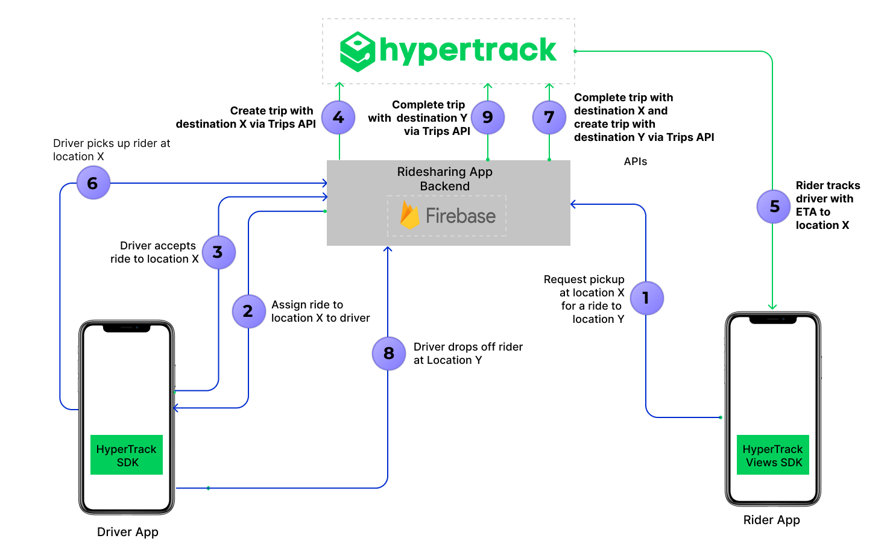

# Build ridesharing driver & rider sample apps using HyperTrack SDK

<p align="center">👉 <a href="https://github.com/hypertrack/ridesharing-android">Looking for the Android version?</a></p>

<p align="center">
  
</p>

Uber’s business model has given rise to a large number of Uber-for-X services. Among other things, X equals moving, parking, courier, groceries, flowers, alcohol, dog walks, massages, dry cleaning, vets, medicines, car washes, roadside assistance and marijuana. Through these on-demand platforms, supply and demand are aggregated online for services to be fulfilled offline.

This open source repo/s uses HyperTrack SDK for developing real world Uber-like consumer & driver apps.

 - **Ridesharing Rider app** can be used by customer to :
      - Allow customer to select pickup and dropoff location
      - Book a ride from desired pickup and dropoff location
      - Track driver to customer's pickup location
      - Track the ongoing ride to dropoff location
      - Let customers share live trip with friends and family
      - Show trip summary with distance travelled

<p align="center">
 <a href="https://www.youtube.com/watch?v=1qMFP5w32GY">
  
 </a>
</p>


- **Ridesharing Driver app** can be used by driver to :
     - Find new rides
     - Accept a ride
     - Track and navigate till customer's pickup location, and mark the pickup as complete
     - Track and navigate from customer's pickup to dropoff location, and mark the dropoff as complete
     - Show trip summary with distance travelled

<p align="center">
 <a href="https://www.youtube.com/watch?v=3R9GDQitt40">
  
 </a>
</p>

## Architecture


- The Driver App uses HyperTrack SDK ([iOS](https://github.com/hypertrack/quickstart-ios)/[Android](https://github.com/hypertrack/quickstart-android)) to send its location, name, and metadata to HyperTrack's servers
- Driver and Rider Apps use HyperTrack Views SDK ([iOS](https://github.com/hypertrack/views-ios)/[Android](https://github.com/hypertrack/views-android)) to show the driver's current location and trip's route
- Driver and Rider Apps are subscribed to [Firebase Cloud Firestore](https://firebase.google.com/docs/firestore) to sync users and orders between them
- Firebase Cloud Functions react to the order status field in Cloud Firestore, create and complete trips using [HyperTrack Trips APIs](https://www.hypertrack.com/docs/guides/track-trips-with-destination), listen to [HyperTrack Webhooks](https://www.hypertrack.com/docs/guides/track-trips-with-destination#get-trip-updates-on-webhooks) and update the order status and trip fields with new results




<details>
    <summary>Step by step process of communication:</summary>

1. **Request pickup at location X for a ride to location Y**
   - Prior to requesting a pickup, Rider App has already signed up with Ride Sharing App Backend. Ride Sharing App Backend created a new document with the rider's data in its users collection
   - The rider chooses pickup and dropoff places. Rider App sends a request to Ride Sharing App Backend, which creates a new order in its orders collection in Cloud Firestore
2. **Assign ride to location X to driver**
   - Prior to the assignment, Driver App already signed up with Ride Sharing App Backend:
     - Ride Sharing App Backend created a new document with the driver's data in its users collection in Cloud Firestore
     - Driver App added name and metadata through HyperTrack SDK
     - HyperTrack SDK started tracking the driver's location  
     - From this point, the driver can be seen in HyperTrack Dashboard
3. **Driver accepts ride to location X**
   - Driver App is checking with Ride Sharing App Backend periodically, looking for orders with the `NEW` status
   - Once the new order(s) show up, the driver can accept a chosen order. Ride Sharing Backend changes the order status to `ACCEPTED` and sets the driver's data in the order 
4. **Create trip with destination X via Trips API**
   - Once the order status is changed, Ride Sharing Backend triggers `updateOrderStatus` Firebase Cloud Function. The function creates a trip from the driver's current position to the rider's pickup point using [HyperTrack API](https://www.hypertrack.com/docs/guides/track-trips-with-destination). Once the troop is created, the order status is changed to `PICKING_UP`.
5. **Rider tracks driver with ETA to location**
   - Driver and Rider Apps are subscribed to their order. When they see that the status is `PICKING_UP`, they use HyperTrackViews SDK to display the trip live from the order on a map
6. **Driver picks up rider at location X**
   - When the driver crosses destination geofence of the rider's pickup point, a webhook from HyperTrack to Ride Sharing App Backend's Firebase Cloud Function is triggered. This function updates the order to `REACHED_PICKUP` state
7. **Complete trip with destination X and create trip with destination Y via Trips API**
   - Upon receiving `REACHED_PICKUP` order state, Driver App shows a "Start Trip" button. When the driver presses it, Driver App changes the order status to `STARTED_RIDE` state
   - Upon receiving the `STARTED_RIDE` state, Ride Sharing App Backend's Firebase Cloud Function calls [HyperTrack APIs](https://www.hypertrack.com/docs/guides/track-trips-with-destination) to complete the previous trip and creates a new trip to the rider's destination. After the trip is created, the function updates the order status to `DROPPING_OFF`
   - When Driver and Rider Apps see `PICKING_UP` status, they both use HyperTrack Views SDK to display the new trip on a map
8. **Driver drops off rider at Location Y**
   - When the driver crosses the destination geofence of the rider's dropoff point, a webhook from HyperTrack to Ride Sharing App Backend's Firebase Cloud Function triggers again. This function updates the order to `REACHED_DROPOFF` state
   - Upon receiving `REACHED_DROPOFF` order state, the Driver app shows a "End Trip" button. When the driver presses it, Driver app changes the order status to `COMPLETED` state
9. **Complete trip  with  destination Y via Trips API**
   - Ride Sharing App Backend's Firebase Cloud Function proceeds to call [HyperTrack APIs](https://www.hypertrack.com/docs/guides/track-trips-with-destination) complete the dropoff trip 
   - When this trip is completed, Rider and Driver Apps show trip summary using HyperTrack Views SDK
</details>

## How Ridesharing sample apps use HyperTrack API

Ridesharing apps use [HyperTrack Trips API](https://www.hypertrack.com/docs/guides/track-trips-with-destination) to [create](https://www.hypertrack.com/docs/references/#references-apis-trips-start-trip-with-destination) and [complete](https://www.hypertrack.com/docs/references/#references-apis-trips-complete-trip) trips by using Firebase Cloud Functions. Firebase allows ridesharing sample appilcations integrate with HyperTrack Trips API via backend server integration.

For each rider's request that is accepted by the driver, a trip is [created](https://www.hypertrack.com/docs/references/#references-apis-trips-start-trip-with-destination) for the driver to pick up the rider at the rider's location. Once the pick up is completed, the trip is [completed](https://www.hypertrack.com/docs/references/#references-apis-trips-complete-trip) and then the new trip is [created](https://www.hypertrack.com/docs/references/#references-apis-trips-start-trip-with-destination) for the driver to get the rider to rider's destination. Once the rider reaches the destination and is dropped off, the trip is [completed](https://www.hypertrack.com/docs/references/#references-apis-trips-complete-trip).

## How Ridesharing sample apps use HyperTrack SDK

Ridesharing Driver app uses HyperTrack SDK to track driver's position in 3 cases:
- When app is active to display all drivers locations on riders maps
- When driver is picking up rider
- When driver is dropping off rider

You can find the SDK documentation [here](https://github.com/hypertrack/quickstart-ios).

### Silent push notifications

Driver app integrates HyperTrack SDK with silent push notifictions to:
- Start tracking location immediately when Firebase creates a trip for accepted order
- Stop tracking location when app is backgrounded and there are no trips lift

HyperTrack SDK has four methods to integrate silent push notifications:
- `registerForRemoteNotifications()`, registers the app in OS to receive notifications
- `didRegisterForRemoteNotificationsWithDeviceToken(_:)` to transfer device token to HyperTrack SDK
- `didFailToRegisterForRemoteNotificationsWithError(_:)` to signal failure to register for remote notifications
- `didReceiveRemoteNotification(_:fetchCompletionHandler:)` transfers silent push notification to HyperTrack SDK

Here is how they are integrated in Driver app:
```swift
 func application(
    _: UIApplication,
    didFinishLaunchingWithOptions
    _: [UIApplication.LaunchOptionsKey: Any]?
  ) -> Bool {
    /// Register for remote notifications to allow bi-directional communication model with the
    /// server. This enables the SDK to run on a variable frequency model, which balances the
    /// fine trade-off between low latency tracking and battery efficiency, and improves robustness.
    /// This includes the methods below in the Remote Notifications section
    HyperTrack.registerForRemoteNotifications()
    /// Configure Firebase
    FirebaseApp.configure()
    return true
  }

  func application(
    _: UIApplication,
    didRegisterForRemoteNotificationsWithDeviceToken deviceToken: Data
  ) {
    HyperTrack.didRegisterForRemoteNotificationsWithDeviceToken(deviceToken)
  }

  func application(
    _: UIApplication,
    didFailToRegisterForRemoteNotificationsWithError error: Error
  ) {
    HyperTrack.didFailToRegisterForRemoteNotificationsWithError(error)
  }

  func application(
    _: UIApplication,
    didReceiveRemoteNotification userInfo: [AnyHashable: Any],
    fetchCompletionHandler completionHandler:
    @escaping (UIBackgroundFetchResult) -> Void
  ) {
    HyperTrack.didReceiveRemoteNotification(
      userInfo,
      fetchCompletionHandler: completionHandler
    )
  }
```

### SDK Initialization

HyperTrack SDK initializes successfully when nothing prevents it from tracking. This is modeled by `Result` type. Here, in Driver app, when `Result` is `.success` we present one UI and when it's `.failure` another. This ensures that UI that get initialized SDK won't get null, and can use the SDK freely, and UIs designed for error handling won't get SDK at all, and will only display errors.

```swift
switch HyperTrack.makeSDK(
  publishableKey: HyperTrack.PublishableKey(getPublishableKeyfromPlist())!
) {
  case let .success(hypertrack):
    let store = Store(
      initialValue: AppState(),
      reducer: appReducer
    )
    let dataflow = DriverDataFlow(store: store, hypertrack: hypertrack)
    return AnyView(ContentView(
      store: store,
      dataflow: dataflow,
      hypertrack: hypertrack
    ))
  case let .failure(error):
    switch error {
      case let .developmentError(devError):
        fatalError("\(devError)")
      case let .productionError(prodError):
        return AnyView(ErrorView(store: Store(
          initialValue: AppState(),
          reducer: appReducer
        ), error: HError(error: prodError)))
    }
}
```

### DeviceID

DeviceID is used to identify a device on HyperTrack. Driver app uses this ID when creating a user in Firebase.

```swift
private func makeNewUser() {
  let user = User(
    id: nil,
    role: .driver,
    name: name,
    phone_number: phone,
    device_id: hypertrack.deviceID,
    car: User.Car(model: carModel, license_plate: carPlate)
  )
  setNewFirestoreUser(db, user) { result in
    switch result {
      case let .success(user):
        self.makeHTUser(user)
        self.store.value.user = user
        self.store.update(.permissions)
      case let .failure(error):
        print("An error occurred: \(error)")
    }
  }
}
```

Later in Views SDK snippets, both Driver and Rider app are using this ID to display driver on a map.

### Device name and metadata

Device name and metadata are displayed in HyperTrack's [dashboard](https://dashboard.hypertrack.com). To make it easy for operators to find drivers by their name or filter them by metadata, Driver app sets those fields using User model from Firebase:

```swift
private func makeHTUser(_ user: User) {

  let id = user.id ?? ""
  let name = user.id ?? ""
  let phoneNumber = user.phone_number ?? ""
  let carModel = user.car?.model ?? ""
  let carLicensePlate = user.car?.license_plate ?? ""
  let car = ["model": carModel, "license_plate": carLicensePlate]

  hypertrack.setDeviceName(user.name)
  if let metadata = HyperTrack.Metadata(dictionary: [
    "user_id": id,
    "name": name,
    "phone_number": phoneNumber,
    "car": car
  ]) {
    hypertrack.setDeviceMetadata(metadata)
  }
}
```

### Start tracking and sync device settings

Driver app tracks the driver in an interesting way. We want to always track driver when the app is running in foreground. This allows us to show cars of available drivers in Rider app's map. At the same time we want to track drivers in background only when they have an active order. In this snippet we subscribe to OS notifications and call `start()` tracking when app is brought to foreground. But when the app is going into background we consult with `syncDeviceSettings()` to stop tracking if driver doesn't have active trips.

```swift
.onReceive(appStateReceiver.$notification) { notification in
  switch(notification.name, self.store.value.user) {
    case (UIApplication.didBecomeActiveNotification, let user):
      self.hypertrack.start()
    case (UIApplication.didEnterBackgroundNotification, _):
      self.hypertrack.syncDeviceSettings()
    default: break
  }
}
```

## How Ridesharing sample apps use Views SDK

Both Rider and Driver apps use [HyperTrackViews SDK](https://github.com/hypertrack/views-ios) to display realtime location and trip updates on a map.

### Subscribing to location updates

Both Driver and Rider apps subscribe to driver's location updates using `subscribeToMovementStatusUpdates(for:completionHandler:)` method:

```swift
func createUserMovementStatusSubscription() {
  ht_cancelable =
    hyperTrackViews.subscribeToMovementStatusUpdates(
      for: self.hypertrack.deviceID,
      completionHandler: { [weak self] result in
        guard let self = self else { return }
        switch result {
          case let .success(movementStatus):
            self.movementStatusWillChange.send(movementStatus)
            self.getTripSummary()
          case let .failure(error):
            dump(error)
            self.createUserMovementStatusSubscription()
        }
      }
    )
}
```

### Placing device or trip on a map

MapKit part of the library can put any `CLLocation` as devices location.

Driver's location is taken from MovementStatus:

```swift
private func configureForNewState(_ mapView: MKMapView) {
  removeAllAnnotationExceptDeviceAnnotation(mapView: mapView)
  mapView.addAnnotations(dataflow.orderList.map { OrderAnnotation(order: $0) } )
  if let movementStatus = self.movementStatus {
    put(.location(movementStatus.location), onMapView: mapView)
  }
}
```

Rider's location is taken from the map itself:

```swift
private func configureForLookingState(_ mapView: MKMapView) {
  guard let location = self.location else { return }
  put(.location(location), onMapView: mapView)
}
```

When driver is picking up or dropping off rider, the estimated route is displayed. This route comes from a trip, and `.locationWithTrip` enum is used to display both driver's current position and his route to destination:

```swift
private func configureForDrivingState(_ mapView: MKMapView) {
  if let device = self.dataflow.userMovementStatus, let trip = mStatus.trips.first(
    where: { $0.id == self.dataflow.store.value.order?.trip_id }
  ) {
    put(.locationWithTrip(device.location, trip), onMapView: mapView)
  } else {
    configureForLookingState(mapView)
  }
}
```

### Making the device or trip center on a map

In apps that show tracking data, usually user needs to see all the data on the screen, be it current location, trip polylines or destination markers. This view needs to re-zoom with animation every time the data is changing. This is done in the Uber app.

We also don't want to auto-zoom if user touched the map and zoomed in to his location of choise. In this snippet a private function decides, based on user's input, if auto-zoom is needed and uses our Views function (`zoom(withMapInsets:interfaceInsets:onMapView:)`) that understands what is shown on the screen (be it current location, trip or summary) and auto-zooms on it.

This function can take different values for insets based on distance in meters (here we are making an inset for 100 meters in all directions, so elements won't touch the screen. But also there are cases where UI elements are shown on top of our map, and in those cases we don't want to accidentally miss relevent data under those elemets. For those cases the zoom function has interfaceInsets parameter.

In this case we have a card at the bottom 250 points in height, and a statusbar element at the top for 10 points.

```swift
private func isZoomNeeded(_ mapView: MKMapView) {
  if self.isAutoZoomEnabled {
    zoom(
      withMapInsets: .all(100),
      interfaceInsets: .custom(
        top: 10,
        leading: 10,
        bottom: 250,
        trailing: 10),
      onMapView: mapView)
  }
}
```

## How to Begin

### 1. Get your keys
 - [Signup](https://dashboard.hypertrack.com/signup) to get your [HyperTrack Publishable Key](https://dashboard.hypertrack.com/setup)

### 2. Set up rider & driver app
```bash
# Clone this repository
$ git clone https://github.com/hypertrack/ridesharing-ios.git

# cd into the project directory
$ cd ridesharing-ios

# Install dependencies (can take a while)
$ pod install
```

- Open Ridesharing.xcworkspace
- Add the publishable key to Utility > [`Interface.swift`](https://github.com/hypertrack/ridesharing-ios/blob/e46306c06e3f8b0d9a7372ef15663dc509451b1e/Utility/Interface.swift#L10) > `let publishableKey` constant
```swift
public let publishableKey: String = "YOUR_PUBLISHABLE_KEY_HERE"
```

### 3. Set up Firebase
 - Create a Firebase project. For detail steps refer to _Step 1_: https://firebase.google.com/docs/ios/setup#create-firebase-project
 - Register Driver app with `com.hypertrack.ridesharing.driver.ios.github` bundle ID and Rider app with `com.hypertrack.ridesharing.rider.ios.github` bundle ID. More details in _Step 2_: https://firebase.google.com/docs/ios/setup#register-app
 - Move Driver app's `GoogleService-Info.plist` to the Driver app target and Rider's to Riders. Described in _Step 3_: https://firebase.google.com/docs/ios/setup#add-config-file No need to follow Step 4 and 5, they are already implemented in the app.
 - Create Cloud Firestore database in test mode by following the "Create a Cloud Firestore database" section from this guide https://firebase.google.com/docs/firestore/quickstart#create No need to follow other steps, they are already implemented in the app.
 - Follow instructions in our [firebase repo](https://github.com/hypertrack/ridesharing-firebase) to setup Firebase Cloud Functions that act as a backend, interacting with HyperTrack APIs.
 - Note that Firebase Cloud Firestore and Cloud Functions are _not required_ to use HyperTrack SDKs. You may have your own server that is connected to your apps.

### 4. Run the apps

- You can run the Rider app in Simulator, but Driver app needs to be run on-device due to Simulator's lack of motion hardware.
- Being able to run the apps and signup means that the whole setup works.
- In these samples apps, Driver app creates actions for pickup and drop, which are tracked by Driver & Rider apps. See [architecture](#architecture) for details.

## Documentation
For detailed documentation of the APIs, customizations and what all you can build using HyperTrack, please visit the official [docs](https://www.hypertrack.com/docs/).

## Contribute
Feel free to clone, use, and contribute back via [pull requests](https://help.github.com/articles/about-pull-requests/). We'd love to see your pull requests - send them in! Please use the [issues tracker](https://github.com/hypertrack/ridesharing-ios/issues) to raise bug reports and feature requests.

We are excited to see what live location feature you build in your app using this project. Do ping us at help@hypertrack.com once you build one, and we would love to feature your app on our blog!

## Support
Join our [Slack community](https://join.slack.com/t/hypertracksupport/shared_invite/enQtNDA0MDYxMzY1MDMxLTdmNDQ1ZDA1MTQxOTU2NTgwZTNiMzUyZDk0OThlMmJkNmE0ZGI2NGY2ZGRhYjY0Yzc0NTJlZWY2ZmE5ZTA2NjI) for instant responses. You can also email us at help@hypertrack.com.
